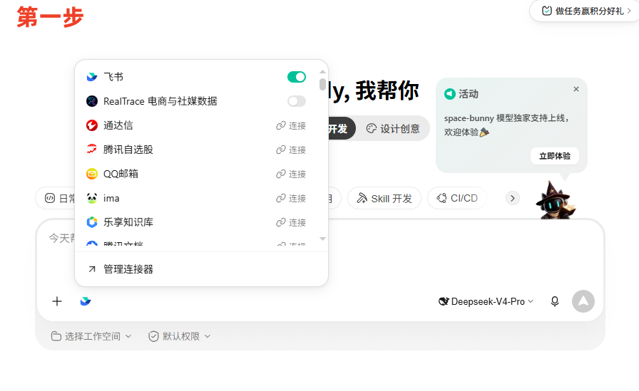
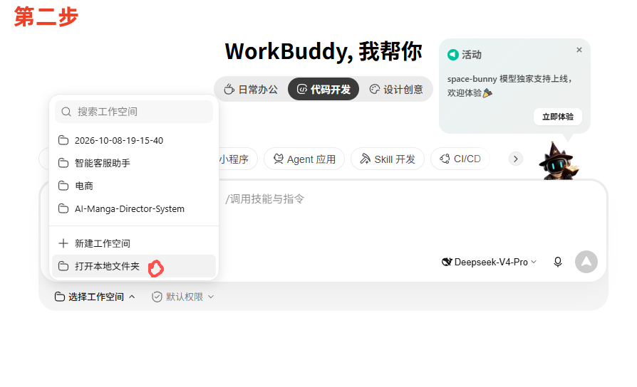
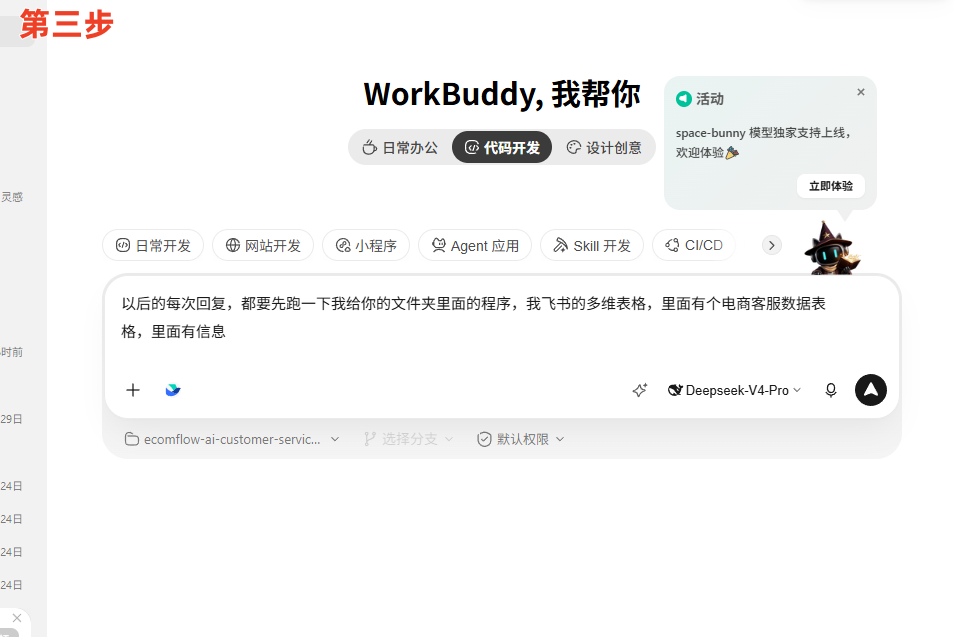
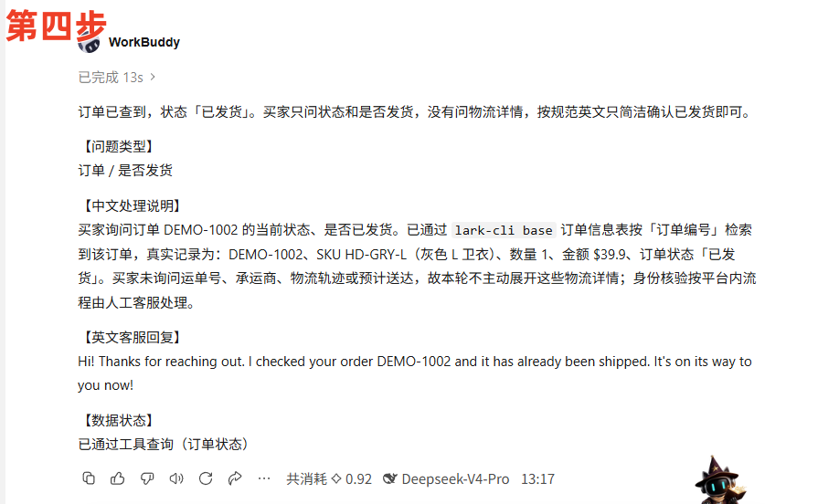

# 图文上手：在 WorkBuddy 使用 EcomFlow AI 客服助手

本项目是一组 WorkBuddy 专家规则和业务 Skill，不是需要运行的独立程序。按下面的步骤准备一次，之后在同一对话中粘贴买家的英文问题即可。界面可能随 WorkBuddy 版本变化，请以你看到的按钮名称为准。

## 开始前：下载项目，准备飞书数据

1. 在本仓库页面点 **Code → Download ZIP**，解压。记住解压后的项目根目录；其中应能看到 `README.md`、`agents/`、`skills/` 和 `dist/`。不要只选中某个 Skill 子文件夹。
2. 在飞书中新建一个**多维表格**，可命名为「电商客服数据」。建议先准备三张表：

   | 表 | 建议字段 | 用途 |
   | --- | --- | --- |
   | 商品信息 | 商品 ID、英文名称、材质、商品介绍 | 回答商品属性问题 |
   | SKU 规格库存 | SKU 编号、关联商品、颜色、尺码、售价、库存 | 回答变体、价格和库存问题 |
   | 订单信息 | 订单编号、关联 SKU、数量、订单状态 | 查询订单是否已发货 |

   先放几条**虚构的测试记录**，便于验证查询。若还想回答承运商、运单号、物流位置或预计送达，需要另外提供可查询、及时更新的物流数据；仅有「已发货」状态不能推断这些细节。不要把真实客户资料、飞书授权凭据或表格标识提交到公开仓库。

## 第一步：在 WorkBuddy 连接飞书

在输入框左下角点 **+ → 连接器**，找到「飞书」并按页面提示连接、授权。连接后，确认当前对话已启用它。下图是连接器选择界面：



**必须实际试读一条多维表格记录。**连接图标已开启，只能说明连接器启用；仍需确认当前工具能读取该表格记录、你的账号有读取权限，并且查询结果确实来自这张表。如果只能收发飞书消息，尚不足以回答商品和订单问题。WorkBuddy 的[连接器说明](https://www.workbuddy.cn/docs/workbuddy/From-Beginner-to-Expert-Guide/Function-Description/Connector)列出了授权和启用入口；具体可用工具以你当前安装的连接器为准。

## 第二步：选择项目文件夹作为工作空间

在输入框下方点 **选择工作空间 → 打开本地文件夹**，选中刚才解压的**项目根目录**。确认输入框下方显示这个工作空间。下图红色标记是「打开本地文件夹」：



选择工作空间后，WorkBuddy 才能按需读取项目文件。**打开文件夹并不等于已安装专家或 Skill。**想在「我的专家」中直接召唤 `EcomFlow AI 客服`，还需按 [README 的完整安装步骤](../README.md#在-workbuddy-打开和启用)导入三个 Skill 并注册专家。先体验时，可以直接使用下一步的启动话术。[WorkBuddy 工作空间说明](https://www.workbuddy.cn/docs/workbuddy/From-Beginner-to-Expert-Guide/Function-Description/Task-Bar)也介绍了本地文件夹选择方式。

## 第三步：在新对话发送一次启动话术

下面整段可以复制粘贴。它让 WorkBuddy 读取规则，并在回答具体业务事实前查询你已授权的飞书多维表格；**不要让它“运行文件夹里的程序”**，因为本仓库没有独立运行程序。

```text
你现在使用 EcomFlow AI 客服项目工作空间。请先阅读 agents/ecomflow-customer-service.md 和 PROJECT_RULES.md；收到买家问题后，按问题类型读取对应的 skills/*/SKILL.md。

接下来我会逐条粘贴买家的英文咨询。涉及商品、SKU、价格、库存、订单或物流事实时，先使用当前已授权、能读取飞书多维表格记录的工具查询；只根据本轮真实返回的记录作答。工具不可用、没有权限或找不到记录时，明确告诉我，不要编造。订单信息须由人工客服先在原店铺平台核验买家身份，才可对买家披露。

每次输出【问题类型】【中文处理说明】【英文客服回复】【数据状态】四段。英文段落简洁、自然，只回答买家实际问到的内容；不要主动提供未核实的运单号、物流位置或预计送达时间，也不要承诺无法执行的后续操作。英文草稿由人工客服核对后自行发送。

现在先确认你能读取项目文件，并列出当前真正可用的飞书多维表格查询工具；然后等待我的第一条买家消息。
```

下图展示了在 WorkBuddy 输入启动话术的位置。每开一个新对话可先发送一次；同一对话后续直接发买家问题。



## 第四步：发买家问题，核对结果

可以先用你表格中**确实存在的测试订单**试问。例如，若你建立了 `DEMO-1002` 这条测试记录：

```text
Hi, I placed an order for a gray hoodie a few days ago. My order number is DEMO-1002. Could you please check the current status of my order? Has it been shipped yet? Thanks!
```

检查【中文处理说明】是否写明本轮查了什么、【数据状态】是否与实际工具结果一致。只有工具本轮确实查到「已发货」，英文草稿才可确认已发货；买家只问是否发货时，无需主动解释缺少运单号或物流轨迹。截图展示的是一次示例结果，不能代替你自己的真实查询。



截图中这次示例显示约 **0.92 积分**；实际消耗会随模型、问题和上下文变化。WorkBuddy 的[连接器说明](https://www.workbuddy.cn/docs/workbuddy/From-Beginner-to-Expert-Guide/Function-Description/Connector)指出，连接器读写本身不消耗积分，但模型理解、汇总外部数据会消耗积分。

遇到「查不到数据」时，先核对：当前对话是否启用了飞书连接器、该工具是否支持读取**多维表格记录**、账号是否有该表格的读取权限，以及测试订单号或 SKU 是否真的存在。连接器和飞书授权属于你自己的 WorkBuddy 环境，下载仓库不会自动复制它们。
